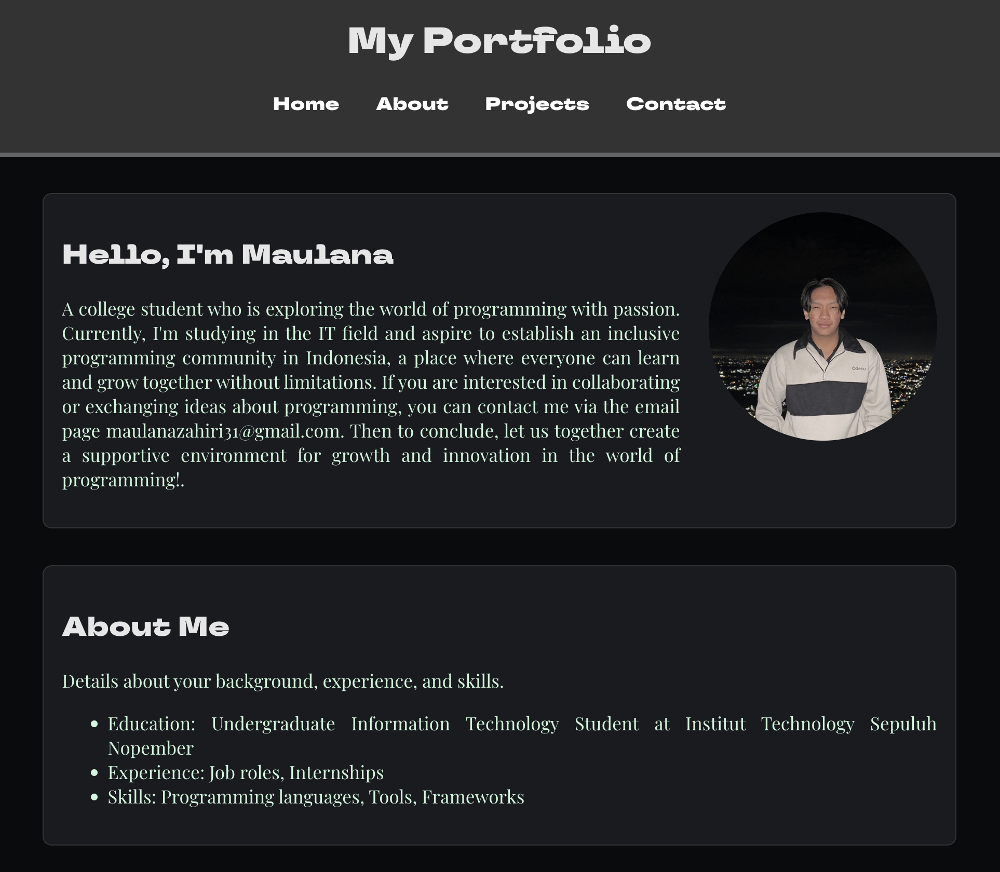
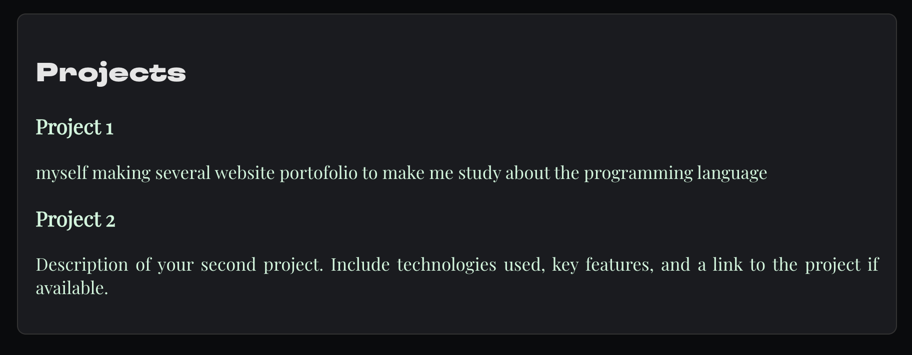
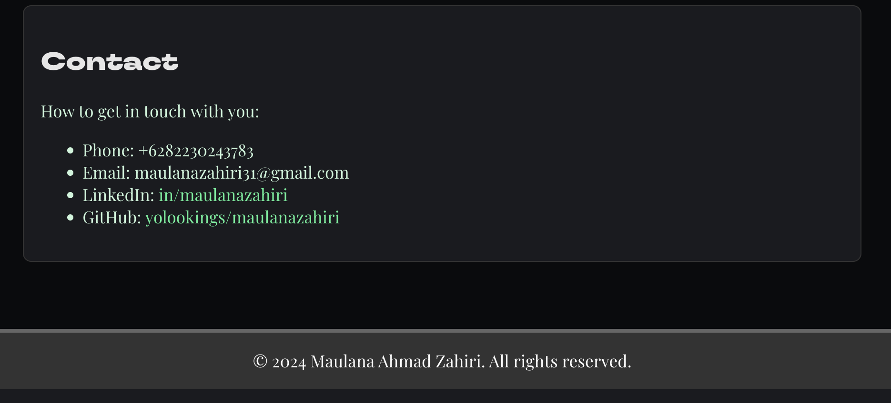

# My Portfolio

Welcome to my portfolio! This is a personal website created to showcase my projects, skills, and experience. The portfolio is built using React and features a classic design.

## Table of Contents

- [Introduction](#introduction)
- [Features](#features)
- [Technologies Used](#technologies-used)
- [Documentation](#documentation)
- [Setup and Installation](#setup-and-installation)
- [Usage](#usage)
- [Contributing](#contributing)
- [License](#license)

## Introduction

This portfolio is designed to provide an overview of my professional background, including my education, work experience, skills, and projects. It serves as a central hub where potential employers, clients, or collaborators can learn more about me and my work.

## Features

- **Responsive Design**: The website is responsive and looks great on all devices.
- **Classic Style**: The design follows a classic aesthetic with serif fonts and a timeless color scheme.
- **Sections**:
  - **Home**: Introduction and a brief overview.
  - **About**: Detailed information about my background, education, and skills.
  - **Projects**: Showcase of my projects with descriptions and links.
  - **Contact**: Ways to get in touch with me.

## Technologies Used

- **React**: A JavaScript library for building user

## Documentation

- here information about myself
  
- here information about my projects and
  
- here information about my contacs
